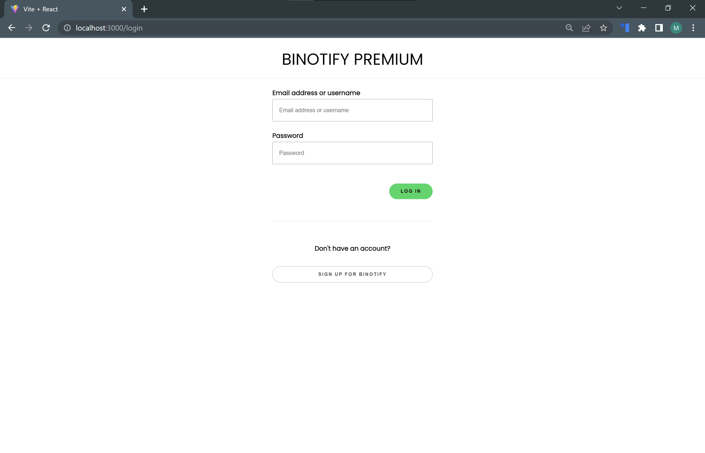
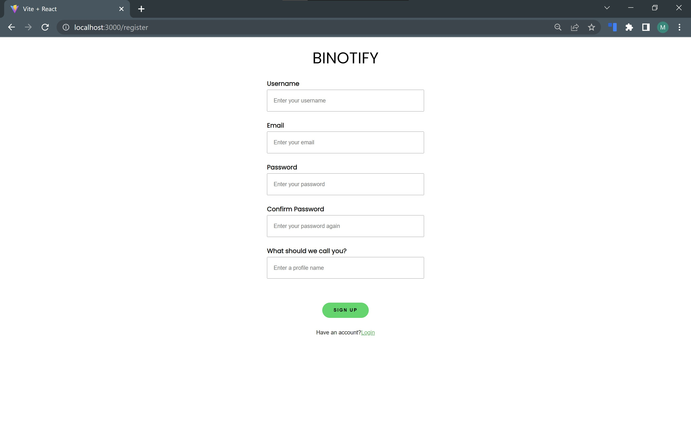
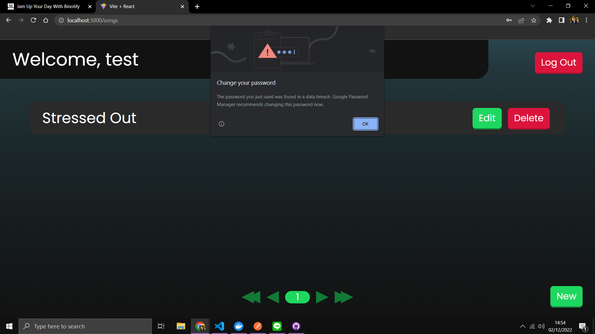
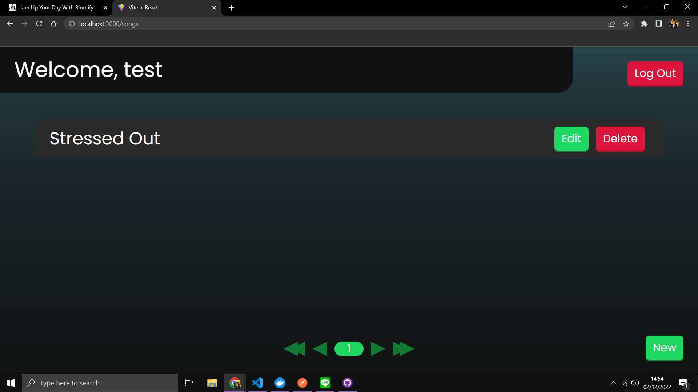
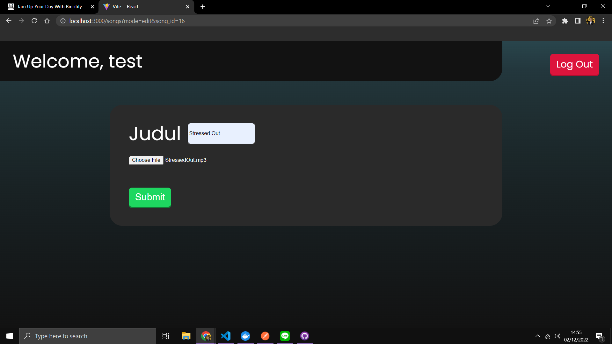

# Website Binotify Premiums

## Daftar Isi
- [Deskripsi](#deskripsi)
- [Cara menjalankan](#cara-menjalankan-server)
- [Screenshot](#screenshot)
- [Pembagian tugas](#pembagian-tugas)

## Deskripsi
Wesbite binotify premium merupakan sebuah untuk penyanyi yang memiliki lagu-lagu premium. Pada website ini akan terdapat admini yang dapat menerima ataupun menolak permintaan subscription dari user pada binotify app. Seorang user (penyanyi premium) dapat menambahkan, melihat, update, dan delete lagu miliknya.

## Cara Menjalankan
1. Jalankan `npm install` untuk menginstall semua dependency
2. Jalankan `npm run dev` untuk menjalankan aplikasi

## Screenshot
1. Halaman Login

2. Halaman Register

3. Halaman Songs

4. Halaman Songs Admin

5. Halaman Edit Song

6. Halaman Add Song

## Pembagian Tugas
- Halaman Login: 13520096
- Halaman Register: 13520096
- Halaman List Permintaan Subscription: 13520049
- Halaman Pengelolaan Lagu: Nathanael Santoso

## Author
- 13520049 - Aditya Prawira Nugroho
- 13520096 - Monica Adelia
- 13520129 - Nathanael Santoso